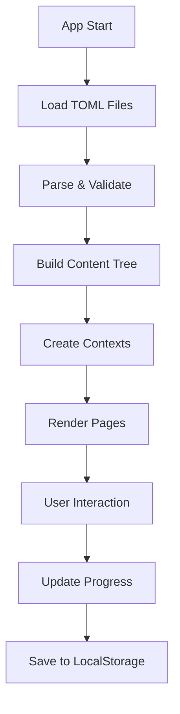

# TOML-Based Content Management System Implementation Plan

## Executive Summary

This plan outlines the migration from the current fragmented content management system to a unified TOML-based architecture for 12Factor.me. The new system will consolidate all content (principles, courses, flashcards, quizzes) into a single, maintainable structure that supports bilingual content and dynamic page generation.

## Current State Analysis

### Problems with Current System
1. **Content Fragmentation**: Content spread across 15+ files
   - `src/data/principles.ts` - Basic principle structure
   - `src/messages/{en,zh}/*.json` - 10+ translation files
   - `src/data/courses/*` - Multiple course files
   - Components with hardcoded content

2. **Maintenance Challenges**
   - Deep nesting in translation files (5+ levels)
   - Duplicate content across files
   - No single source of truth
   - Difficult to track content relationships

3. **Scalability Issues**
   - Adding new principles requires updates in 5+ files
   - Course content structure is rigid
   - No content validation system

## Proposed TOML Structure

### Architecture Overview
```
content/
├── main.toml           # Primary content file
├── courses/            # Extended course content
│   ├── fundamentals.toml
│   ├── intermediate.toml
│   └── advanced.toml
└── schema.toml        # Validation schema
```

### Key Design Principles

1. **Unified Content Model**
   - All content types share common structure
   - Bilingual content side-by-side
   - Clear relationships between entities

2. **Hierarchical Organization**
   ```toml
   Stages → Principles → Learning Materials
                      ↓
           Flashcards | Quizzes | Courses
   ```

3. **Learning Path Integration**
   - Sequential learning steps
   - Mode transitions (learn → practice → test)
   - Progress tracking metadata

## Implementation Architecture

### 1. TOML Parser Service
```typescript
// src/services/content-loader.ts
interface ContentLoader {
  loadContent(): Promise<ContentStructure>
  validateContent(content: any): ValidationResult
  getContentByLocale(locale: string): LocalizedContent
  watchForChanges(): void
}
```

### 2. Content Provider Pattern
```typescript
// src/providers/ContentProvider.tsx
const ContentProvider: React.FC = ({ children }) => {
  const content = useContentLoader()
  return (
    <ContentContext.Provider value={content}>
      {children}
    </ContentContext.Provider>
  )
}
```

### 3. Dynamic Page Generation
```typescript
// src/app/[locale]/principles/page.tsx
export default function PrinciplesPage() {
  const { principles, stages } = useContent()
  return <PrinciplesList data={principles} stages={stages} />
}
```

## Migration Strategy

### Phase 1: Infrastructure (Week 1)
1. **Install Dependencies**
   ```bash
   npm install @iarna/toml zod
   ```

2. **Create Content Loader**
   - TOML parser implementation
   - Schema validation
   - Caching layer

3. **Setup Content Provider**
   - React Context for content distribution
   - Locale-aware content selection
   - Hot reload in development

### Phase 2: Content Migration (Week 2)
1. **Migrate Principles**
   - Extract from `principles.ts`
   - Merge translations from JSON files
   - Add flashcard and quiz content

2. **Migrate Courses**
   - Consolidate course files
   - Standardize practice exercises
   - Add playground scenarios

3. **Create Learning Paths**
   - Define beginner/intermediate/advanced paths
   - Link principles to courses
   - Set progression rules

### Phase 3: Component Updates (Week 3)
1. **Update Data Consumers**
   ```typescript
   // Before
   import { principles } from '@/data/principles'
   
   // After
   const { principles } = useContent()
   ```

2. **Remove Translation Files**
   - Replace `useTranslations()` with content hooks
   - Remove JSON translation files
   - Update locale switching logic

3. **Update Dynamic Routes**
   - Course pages use TOML content
   - Quiz generation from TOML
   - Flashcard system migration

### Phase 4: Testing & Validation (Week 4)
1. **Content Validation**
   - Schema validation tests
   - Required field checks
   - Translation completeness

2. **Integration Testing**
   - Page rendering tests
   - Navigation flow tests
   - Learning path progression

3. **Performance Testing**
   - Content loading benchmarks
   - Memory usage analysis
   - Build time optimization

## Technical Implementation Details

### Content Loading Flow


### API Structure
```typescript
interface ContentAPI {
  // Core content
  getStages(): Stage[]
  getPrinciples(stageId?: string): Principle[]
  getPrinciple(id: string): Principle
  
  // Learning materials
  getFlashcards(principleId?: string): Flashcard[]
  getQuizQuestions(config: QuizConfig): Question[]
  
  // Courses
  getCourses(): Course[]
  getCourse(id: string): Course
  getCourseSection(courseId: string, sectionId: string): Section
  
  // Progress
  trackProgress(event: ProgressEvent): void
  getProgress(userId?: string): UserProgress
}
```

### File Structure Changes
```
Before:
src/
├── data/
│   ├── principles.ts
│   ├── courses/
│   └── notebook-content.ts
├── messages/
│   ├── en/*.json (5 files)
│   └── zh/*.json (5 files)

After:
src/
├── content/
│   ├── main.toml
│   └── courses/*.toml
├── services/
│   └── content-loader.ts
├── providers/
│   └── ContentProvider.tsx
```

## Benefits of TOML Migration

### 1. Maintainability
- **Single Source**: All content in one place
- **Clear Structure**: Hierarchical, readable format
- **Version Control**: Better diff visibility
- **Documentation**: Self-documenting structure

### 2. Scalability
- **Easy Extensions**: Add new principles/courses easily
- **Flexible Schema**: Adapt to new requirements
- **Modular Content**: Reusable content blocks
- **Dynamic Loading**: Load only needed content

### 3. Developer Experience
- **Type Safety**: Generated TypeScript types from TOML
- **Hot Reload**: Instant content updates in dev
- **Validation**: Catch content errors early
- **Tooling**: TOML editor support

### 4. Content Management
- **Bilingual Support**: Side-by-side translations
- **Content Relationships**: Clear dependencies
- **Bulk Operations**: Easy content updates
- **Export/Import**: Content portability

## Testing Strategy

### Unit Tests
```typescript
describe('ContentLoader', () => {
  test('loads and parses TOML correctly', async () => {
    const content = await loader.loadContent()
    expect(content.principles).toHaveLength(12)
  })
  
  test('validates required fields', () => {
    const invalid = { principles: [{ id: 'test' }] }
    expect(() => loader.validateContent(invalid)).toThrow()
  })
})
```

### Integration Tests
```typescript
describe('Content Integration', () => {
  test('principles page renders all content', async () => {
    render(<PrinciplesPage />)
    await waitFor(() => {
      expect(screen.getAllByRole('article')).toHaveLength(12)
    })
  })
})
```

### E2E Tests with Playwright
```typescript
test('learning path progression', async ({ page }) => {
  await page.goto('/zh/principles')
  await page.click('[data-principle="single-source-of-truth"]')
  await page.click('[data-action="start-flashcard"]')
  await expect(page).toHaveURL('/zh/flashcards/single-source-of-truth')
})
```

## Rollback Plan

If issues arise during migration:

1. **Feature Flag Control**
   ```typescript
   const USE_TOML_CONTENT = process.env.NEXT_PUBLIC_USE_TOML === 'true'
   ```

2. **Gradual Rollout**
   - Start with principles only
   - Add courses incrementally
   - Monitor performance metrics

3. **Backup Strategy**
   - Keep original files until stable
   - Maintain compatibility layer
   - Document rollback procedures

## Success Metrics

### Quantitative Metrics
- **Build Time**: < 10s (currently ~15s)
- **Content Load Time**: < 100ms
- **Memory Usage**: < 50MB for content
- **File Count**: Reduce from 20+ to 5 files

### Qualitative Metrics
- **Developer Satisfaction**: Easier content updates
- **Content Quality**: Fewer inconsistencies
- **Maintenance Time**: 50% reduction in content updates
- **Onboarding Time**: New contributors productive in < 1 hour

## Timeline

| Week | Phase | Deliverables |
|------|-------|-------------|
| 1 | Infrastructure | Content loader, Provider, Schema |
| 2 | Migration | All content in TOML format |
| 3 | Integration | Updated components, Removed old files |
| 4 | Testing | Full test coverage, Performance validation |
| 5 | Deployment | Production release, Monitoring |

## Next Steps

1. **Review & Approve**: Team review of TOML structure
2. **Create Feature Branch**: `feature/toml-content-management`
3. **Implement Phase 1**: Infrastructure setup
4. **Daily Sync**: Progress updates and blockers
5. **Documentation**: Update README and CLAUDE.md

## Appendix: TOML Schema Example

```toml
# Principle Schema
[[principles]]
id = "string, required, unique"
stage = "string, required, enum[prepare|execute|collaborate|iterate]"
order = "number, required"
icon = "string, optional"

[principles.title]
en = "string, required"
zh = "string, required"

[principles.concept]
en = "string, required, max 200 chars"
zh = "string, required, max 200 chars"

[principles.practices]
en = ["array, required, 3-5 items"]
zh = ["array, required, 3-5 items"]
```

This schema ensures content consistency and enables automated validation during build time.